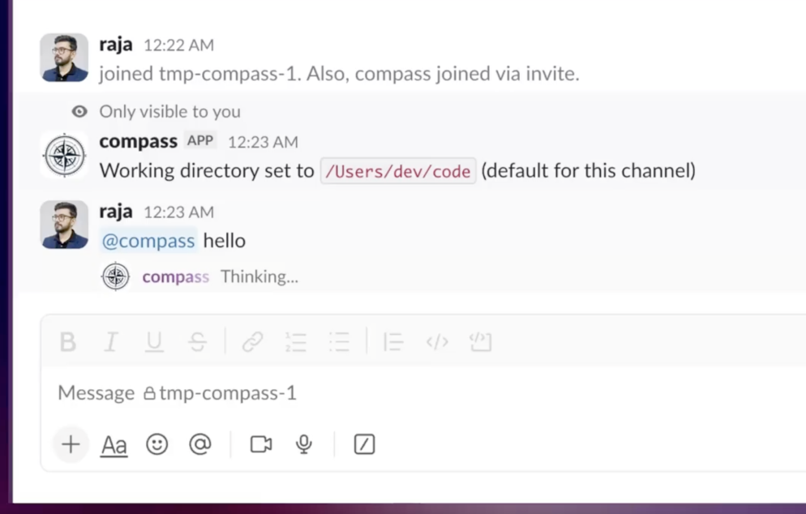
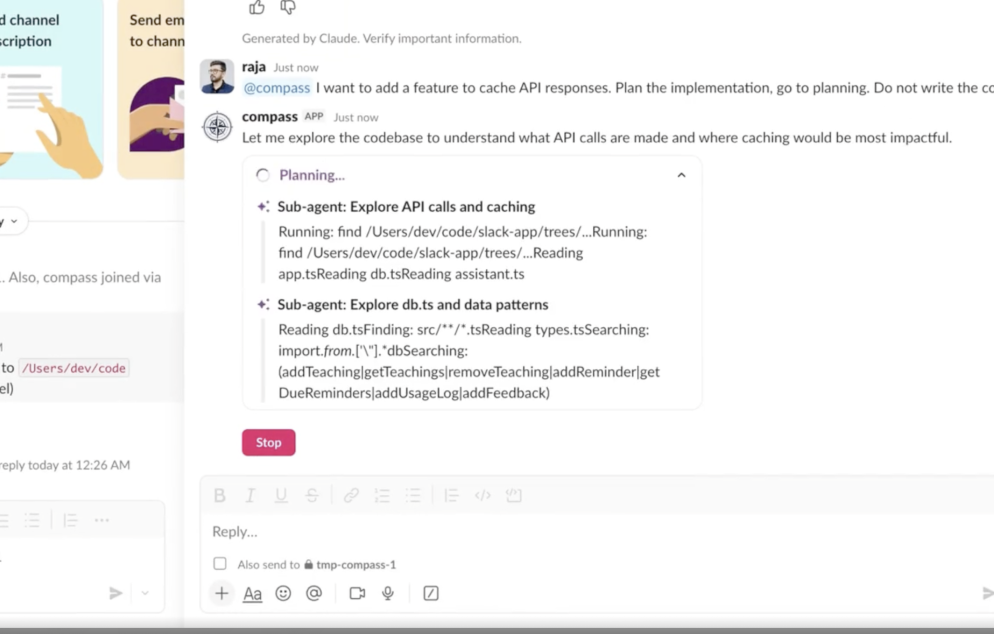

# 🧭 Compass

[](https://github.com/raja-jamwal/compass/actions/workflows/test.yml)
[](https://github.com/raja-jamwal/compass/actions/workflows/publish.yml)
[](https://www.npmjs.com/package/compass-agent)

A Slack app that connects Claude Code to your workspace. Every thread becomes a coding session — set a working directory, ask questions, and get answers with full access to your local filesystem. Claude runs on your machine, streams responses in real-time, and remembers context across messages.


## How it works

The bot runs locally on your machine using Slack's Socket Mode (no public URL needed). When you send a message in the App Home, it spawns a `claude` CLI process, streams the output back to Slack using the native streaming API, and maintains session continuity across messages in the same thread.

```
You (Slack thread) → Bot (Socket Mode) → Claude CLI (local) → Your filesystem
```

Each thread is an isolated session with its own working directory, Claude session ID, and optionally its own git worktree.

## Features

### Per-thread sessions

Every App Home thread is an independent Claude session. The bot tracks session IDs so subsequent messages in the same thread resume the same Claude conversation with full context.

Session lifecycle:
1. First message → new Claude session created
2. Claude's `system.init` event stores the real session ID in SQLite
3. Subsequent messages use `--resume <session_id>` to continue the conversation

### `$cwd` — Working directory

Each thread requires a working directory before Claude can run. This is where Claude will read/write files.

| Command | Description |
|---------|-------------|
| `$cwd` | Opens an interactive picker with recent directories and an "Add new" button |
| `$cwd /path/to/project` | Sets the directory directly |

The picker remembers previously used directories. CWD is stored per-thread in SQLite.



### `$teach` — Team knowledge base

Store team conventions and instructions that get injected into every Claude session via `--append-system-prompt`.

| Command | Description |
|---------|-------------|
| `$teach` | Shows usage help |
| `$teach <instruction>` | Adds a new teaching (strips surrounding quotes) |
| `$teach list` | Lists all active teachings with IDs |
| `$teach remove <id>` | Soft-deletes a teaching by ID |

Examples:
```
$teach Use TypeScript for all new files
$teach Always write tests before implementation
$teach Use pnpm instead of npm
```

Teachings are workspace-wide and persist across sessions. They appear in Claude's system prompt as:
```
Team conventions:
- Use TypeScript for all new files
- Always write tests before implementation
```

### Streaming responses

Responses stream to Slack token-by-token using Slack's native `chatStream` API (`chat.startStream` / `chat.appendStream` / `chat.stopStream`). This gives a smooth typing effect instead of chunked updates.

If streaming fails (e.g., missing permissions or API errors), the bot falls back to throttled `chat.update` calls (every 750ms).

Claude's tool calls are visualized as an agentic timeline — each tool invocation (file reads, code edits, shell commands) appears as a step that progresses from in-progress to complete.



### Stop button

Every response includes a red "Stop" button. Clicking it sends `SIGTERM` to the Claude process. The partial response is preserved with a "_Stopped by user._" suffix.

During streaming mode, the Stop button lives in a separate carrier message that gets deleted after the stream finalizes.

### App Home dashboard

The Home tab shows a live dashboard when you open it:

- **Stats bar** — active sessions, team teachings count, active worktrees, running processes
- **Recent sessions** — last 10 sessions with CWD and status indicator (green = active, white = idle)
- **Recent activity** — last 5 usage logs with model, turns, and cost
- **Quick actions** — "View Teachings" opens a modal listing all teachings; "Add Teaching" opens an input modal

### Git worktree isolation

When the CWD is inside a git repository, the bot automatically creates a git worktree for each thread. This means parallel threads can make code changes without conflicting with each other or your main working tree.

How it works:
1. On first message, `detectGitRepo()` checks if CWD is in a git repo
2. If yes, creates a worktree at `<repo>/trees/slack-<thread_ts>` on a new branch `slack/<thread_ts>`
3. Copies `.env`, `.env.local`, `.env.development` from the main repo
4. Claude spawns in the worktree directory instead of the raw CWD
5. Subsequent messages in the same thread reuse the existing worktree

Cleanup: An hourly job removes worktrees that have been idle for 24+ hours, skipping any with active processes or uncommitted changes.

If the CWD is not a git repo, Claude runs directly in the CWD with no worktree.

### Usage logging

Every Claude invocation logs to the `usage_logs` table:
- Session key, user ID, model
- Input/output tokens, total cost (USD)
- Duration, number of turns

This data powers the "Recent Activity" section on the App Home dashboard.

### User whitelist

Set `ALLOWED_USERS` in `.env` to restrict who can interact with the bot. Comma-separated Slack user IDs.

```
ALLOWED_USERS=U096GJFBZ54,U0XXXXXXXX
```

Leave empty or unset to allow all users.

## Setup

### Prerequisites

- [Bun](https://bun.sh) runtime
- [Claude CLI](https://docs.anthropic.com/en/docs/claude-code) installed and authenticated
- A Slack workspace where you can create apps

### 1. Create the Slack app

1. Go to [api.slack.com/apps](https://api.slack.com/apps) and click "Create New App"
2. Choose "From an app manifest" and paste the contents of `manifest.yml`
3. Install the app to your workspace
4. Under **Settings > Basic Information**, generate an App-Level Token with `connections:write` scope — this is your `SLACK_APP_TOKEN` (starts with `xapp-`)
5. Under **OAuth & Permissions**, copy the Bot User OAuth Token — this is your `SLACK_BOT_TOKEN` (starts with `xoxb-`)

### 2. Configure environment

```bash
mkdir -p ~/.compass
cat > ~/.compass/.env << 'EOF'
SLACK_APP_TOKEN=xapp-1-...
SLACK_BOT_TOKEN=xoxb-...
ALLOWED_USERS=U096GJFBZ54
EOF
```

### 3. Run

```bash
bunx compass
```

That's it. The bot connects via Socket Mode — no ngrok or public URL needed.

You can also point to a specific env file:

```bash
bunx compass --env-file /path/to/.env
```

Or pass tokens directly as environment variables:

```bash
SLACK_APP_TOKEN=xapp-... SLACK_BOT_TOKEN=xoxb-... bunx compass
```

#### Alternative: clone and run locally

If you prefer to run from source:

```bash
git clone https://github.com/anthropics/compass.git
cd compass
cp .env.example .env   # edit with your tokens
bun install
bun start
```

#### Environment loading precedence

When multiple sources provide the same variable, higher priority wins:

1. Real environment variables (highest)
2. `--env-file <path>`
3. `~/.compass/.env`
4. Local `.env` in the current directory (lowest)

### 4. Verify

1. Open the app in Slack (find it in the Apps section)
2. Go to the **Home** tab — you should see the dashboard
3. Start a new thread in the **Messages** tab
4. Send `$cwd /path/to/your/project`
5. Send a question — Claude should respond with streaming text

## Architecture

```
src/
  app.ts                 Entry point — Bolt app, actions, modals, App Home, startup
  db.ts                  SQLite schema (11 tables) and typed prepared statement exports (bun:sqlite)
  types.ts               Shared TypeScript interfaces (row types, runtime types)
  handlers/
    assistant.ts         Assistant handlers — threadStarted, userMessage, commands
    stream.ts            Claude CLI streaming — NDJSON parsing, task chunks, usage logging
  ui/
    blocks.ts            Block Kit builders — stop button, feedback, disclaimer, prompts, dashboard
  lib/
    log.ts               Shared logging helpers (ts, log, logErr, toSqliteDatetime)
    worktree.ts          Git worktree lifecycle operations (create, remove, detect)
  mcp/
    server.ts            MCP server — reminders, teachings, channel CWD tools
manifest.yml             Slack app manifest (scopes, events, features)
sessions.db              SQLite database (auto-created on first run)
```

### Database tables

| Table | Purpose |
|-------|---------|
| `sessions` | Per-thread session tracking (session_id, cwd, user) |
| `cwd_history` | Recently used directories for the picker |
| `team_knowledge` | `$teach` instructions (soft-deletable) |
| `usage_logs` | Token counts, cost, duration per invocation |
| `worktrees` | Active git worktree tracking and cleanup state |
| `feedback` | Thumbs up/down feedback on responses |
| `annotations` | File annotations (future) |
| `shared_sessions` | Session sharing via codes (future) |
| `watched_channels` | Auto-respond channels (future) |
| `snapshots` | Git state snapshots (future) |
| `mcp_configs` | MCP server configurations (future) |

### Message flow

```
1. Slack message arrives via Socket Mode
2. Check: subtype? bot? allowed user?
3. Check: $cwd or $teach command? → handle and return
4. Check: active process in this thread? → reject
5. Session lookup: resume existing or create new (pending → system.init)
6. CWD gate: require working directory
7. Worktree setup: detect git, create/reuse worktree
8. Post "Thinking..." message with Stop button
9. Create chatStream (or fallback to chat.update)
10. Inject team teachings via --append-system-prompt
11. Spawn claude CLI with stream-json output
12. Parse NDJSON events: system.init, text_delta, result
13. Stream text to Slack via chatStream.append() or throttled chat.update
14. On close: finalize stream, log usage, clean up stop button
```

### Logging

Every action produces timestamped structured logs to stdout/stderr:

```
2026-02-14T14:32:01.123Z [D0XXXXXX] Incoming message event: user=U096GJ... ts=1707900000.123456
2026-02-14T14:32:01.124Z [D0XXXXXX] $teach command: arg="Use TypeScript" user=U096GJ...
2026-02-14T14:32:01.200Z [D0XXXXXX] Worktree lookup: thread=1707900000.123456 existingWt=none
2026-02-14T14:32:01.201Z [D0XXXXXX] Git detection: cwd=/Users/dev/project isGit=true repoRoot=/Users/dev/project
2026-02-14T14:32:01.300Z [D0XXXXXX] Created worktree: /Users/dev/project/trees/slack-1707900000-123456
2026-02-14T14:32:01.400Z [D0XXXXXX] Spawning claude: cwd=/Users/dev/project/trees/slack-1707900000-123456
2026-02-14T14:32:02.100Z [D0XXXXXX] stream: type=system subtype=init session_id=abc-123
2026-02-14T14:32:02.500Z [D0XXXXXX] Streamer activated: first append
2026-02-14T14:32:05.000Z [D0XXXXXX] stream: result turns=3 cost=$0.0142
2026-02-14T14:32:05.100Z [D0XXXXXX] Usage logged: cost=$0.0142 turns=3
2026-02-14T14:32:05.200Z [D0XXXXXX] Stream finalized, stop button deleted
```

Errors go to stderr via `logErr()`. The format is `TIMESTAMP [CHANNEL_ID] message`.

## Configuration

| Variable | Required | Description |
|----------|----------|-------------|
| `SLACK_APP_TOKEN` | Yes | App-level token (`xapp-...`) for Socket Mode |
| `SLACK_BOT_TOKEN` | Yes | Bot user OAuth token (`xoxb-...`) |
| `ALLOWED_USERS` | No | Comma-separated Slack user IDs to whitelist |
| `CLAUDE_PATH` | No | Path to the `claude` binary (defaults to `claude` in PATH) |
| `CLAUDE_ADDITIONAL_ARGS` | No | Extra CLI args appended to every `claude` invocation (space-separated) |
| `ENV_*` | No | Variables prefixed with `ENV_` are injected into the Claude process (e.g. `ENV_ANTHROPIC_API_KEY=sk-...` sets `ANTHROPIC_API_KEY`) |

## Manifest scopes

**Bot scopes:** `channels:history`, `channels:read`, `chat:write`, `im:history`, `im:read`, `im:write`, `app_mentions:read`, `assistant:write`, `incoming-webhook`, `commands`

**Bot events:** `message.channels`, `message.im`, `app_mention`, `app_home_opened`, `assistant_thread_started`

**Features:** App Home (messages + home tabs), Bot User, Assistant View, Slash Commands (`/cwd`)
